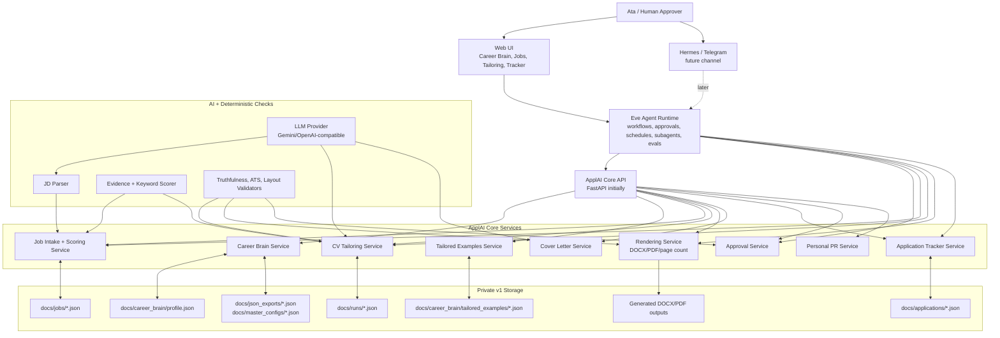
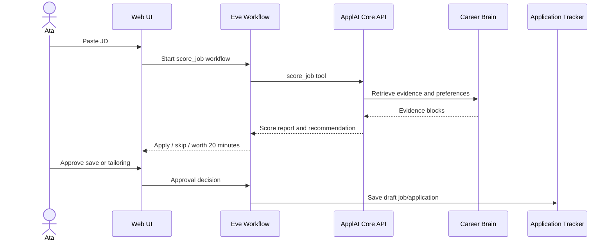
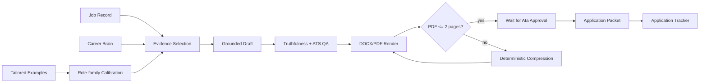

# ApplAI Career Manager Sprint 0 Master Plan

Date: 2026-06-16

Last updated: 2026-06-18

## 1. Current Repo Assessment

ApplAI is already partway through the pivot from a Streamlit job-application workflow to a structured web/API product.

- Current UI/runtime:
  - `app.py` remains the Streamlit fallback.
  - `api/app/main.py` exposes FastAPI routes for health, master CV import/finalize, tailoring runs, run history, and export.
  - `web/` is a Vite + React + TypeScript workspace with pages for masters, tailoring, and runs.
- Useful existing components:
  - `master_cv.py` imports DOCX/PDF masters, persists reviewed sections, and creates template configs.
  - `agent_workflow.py` already contains an 8-module structured tailoring pipeline with canonical CV parsing, JD analysis, evidence scoring, grounded selections, QA, ATS analysis, and change logs.
  - `api/app/schemas/tailoring.py` already mirrors the workflow output contract for API consumers.
  - `artifact_export.py` and `pdf_generator.py` provide the current export bridge.
- Refactor targets:
  - The master CV is structured enough for tailoring, but the broader career profile is not yet durable.
  - Job intake/scoring is coupled to tailoring runs rather than stored as a reusable application pipeline.
  - Page-length validation is not yet a first-class deterministic gate.
  - Personal PR, tracker, and Hermes/Telegram are not represented as durable product modules yet.
  - Agent orchestration is implicit inside backend calls rather than represented as durable, approval-aware workflows.
- Risks:
  - The existing renderer still depends on source-template behavior and may not reliably enforce a two-page budget.
  - LLM parsing can create plausible-but-wrong structure unless every generated block keeps source provenance.
  - Adding scraping too early would distract from the highest-value v1 path: paste job, score, tailor, approve, track.
  - Moving all domain logic into a brand-new agent framework would create avoidable lock-in and rewrite risk.

## 2. Product Direction

ApplAI should become a private personal AI career manager, not a generic job board.

The product should help Ata:

1. Find relevant software, AI, automation, technical analyst, and business-tech roles.
2. Score jobs against his real profile.
3. Tailor a truthful, ATS-friendly CV under two pages.
4. Generate cover letters and application packets.
5. Track application status and follow-ups.
6. Turn projects into LinkedIn, GitHub, portfolio, and interview assets.
7. Reduce application friction without fully automating submission.

The v1 rule is human-in-the-loop. The system may discover, score, draft, tailor, package, and recommend, but Ata must approve before anything is submitted or published.

## 3. Eve-First Architecture Decision

We will move ApplAI toward an Eve-first agent architecture during the overhaul.

The boundary is explicit:

- Eve owns:
  - durable agent workflows,
  - approval gates,
  - schedules,
  - channel adapters,
  - subagent coordination,
  - eval orchestration,
  - user-facing agent behavior.
- ApplAI core services own:
  - Career Brain data,
  - job scoring logic,
  - tailored examples parsing,
  - evidence selection contracts,
  - CV rendering,
  - document export,
  - application tracker persistence.

Do not bury core career logic inside Eve prompts. Eve should call typed tools that wrap deterministic services. This keeps the product portable if Eve APIs change.

Target shape:

```text
React / Next Web UI
        |
        v
Eve Agent Runtime
  - workflows
  - approvals
  - schedules
  - subagents
  - channels
  - evals
        |
        v
ApplAI Core Services
  - Career Brain
  - Job Scoring
  - CV Tailoring
  - DOCX/PDF Rendering
  - Application Tracker
        |
        v
Local JSON now / Postgres later
```

Initial migration posture:

- Add Eve as the orchestration layer now.
- Keep Python/FastAPI CV parsing and rendering operational.
- Wrap existing FastAPI endpoints as Eve tools first.
- Later, migrate selected orchestration-only logic into Eve workflows.
- Avoid rewriting working PDF/DOCX logic in TypeScript until there is a concrete benefit.

## 4. Detailed System Architecture



## 5. Eve Runtime Design

Eve should be introduced as a separate workspace so the existing API/web migration is not disrupted.

Proposed workspace layout:

```text
eve/
  instructions.md
  package.json
  eve.config.ts
  tools/
    score_job.ts
    tailor_cv.ts
    render_cv.ts
    save_application.ts
    list_tailored_examples.ts
    approve_artifact.ts
  skills/
    career_brain.md
    job_scoring.md
    cv_tailoring.md
    ats_quality.md
    approval_policy.md
    personal_pr.md
  subagents/
    job_researcher/
      instructions.md
    job_scorer/
      instructions.md
    cv_tailor/
      instructions.md
    application_packet_builder/
      instructions.md
    personal_pr_agent/
      instructions.md
  workflows/
    score_job.workflow.ts
    tailor_cv.workflow.ts
    application_packet.workflow.ts
    weekly_report.workflow.ts
  evals/
    two_page_cv.eval.ts
    unsupported_claims.eval.ts
    tailored_examples_similarity.eval.ts
    approval_policy.eval.ts
  channels/
    web.ts
    telegram.ts
  schedules/
    daily_jobs.ts
    weekly_report.ts
```

Initial Eve tools should call the ApplAI Core API, not duplicate business logic.

Tool contracts:

- `score_job`
  - Input: `job_description`, optional `company_name`, optional `job_title`, optional `source_url`.
  - Output: `job_id`, `match_score`, `recommendation`, `reasons`, `concerns`, `missing_keywords`, `best_evidence_block_ids`.
- `tailor_cv`
  - Input: `job_id`, `master_id`, `max_pages`, `mode`.
  - Output: `run_id`, `change_log`, `qa_report`, `ats_report`, `draft_artifact_ids`.
- `render_cv`
  - Input: `run_id`, `format`, `max_pages`.
  - Output: `docx_path`, `pdf_path`, `page_count`, `layout_passed`.
- `approve_artifact`
  - Input: `artifact_id`, `decision`, `notes`.
  - Output: `approval_event_id`, `new_status`.
- `save_application`
  - Input: `job_id`, `run_id`, `artifact_ids`, `status`.
  - Output: `application_id`, `next_actions`.
- `list_tailored_examples`
  - Input: optional `role_family`, optional `company`.
  - Output: matching examples and observed tailoring patterns.

Approval policy:

- Any external submit, publish, send, upload, or status-changing action requires explicit approval.
- `render_cv` may run without approval.
- `save_application` may save a draft without approval.
- Marking an application as `ready_to_submit`, publishing LinkedIn content, or sending a message requires approval.

## 6. Core Service Boundary

Core services should remain framework-independent.

- FastAPI is the initial service layer because it already exists.
- Python remains the preferred runtime for:
  - PDF parsing,
  - DOCX manipulation,
  - page-count extraction,
  - current `agent_workflow.py`,
  - tailored examples importer.
- Eve/TypeScript should orchestrate, schedule, and gate workflows.
- If a core service later becomes simple enough to move to TypeScript, migrate only after tests prove parity.

This boundary allows three deployment modes:

1. Local-only development:
   - Eve local runtime calls local FastAPI.
   - Private JSON data stays on the workstation.
2. Hybrid prototype:
   - Web/Eve on Vercel Hobby.
   - Core API runs locally or on the existing VPS.
3. Production later:
   - Eve on Vercel.
   - Core services on VPS, Vercel Functions, or containerized hosting.
   - Storage migrates from JSON to Postgres.

## 7. Industry Research: Content Selection vs Layout Rendering

Professional resume builders generally separate four concerns:

1. Candidate/profile data.
2. Job description analysis.
3. Content suggestions, keyword scoring, and match scoring.
4. Template/layout rendering and export.

Findings by product:

- Teal:
  - Strongest model for ApplAI v1.
  - Imports resumes, supports drag-and-drop section selection, attaches job descriptions, gives match scores, keyword analysis, AI suggestions, and DOC/PDF exports.
  - Architecture lesson: keep reusable resume content separate from job-specific resume versions.
  - Source: https://www.tealhq.com/tools/resume-builder
- Rezi:
  - Strong reference for ATS scoring and resume quality metrics.
  - Emphasizes keyword targeting, content analysis, scoring, ATS checks, and formatting controls.
  - Architecture lesson: add explicit quality gates instead of trusting the generated document.
  - Source: https://www.rezi.ai/
- Huntr:
  - Strong reference for combining job tracker, keyword extraction, qualification extraction, cover letters, and match scoring.
  - Architecture lesson: job records should store parsed responsibilities, qualifications, keywords, and coverage status.
  - Source: https://huntr.co/
- Simplify:
  - Strong reference for "one profile powers the workflow."
  - Uses a profile, job matching, resume tailoring, missing keyword detection, ATS score, tracker, and autofill.
  - Architecture lesson: Career Brain should be the shared substrate for resume, cover letter, tracker, and future form-fill workflows.
  - Source: https://simplify.jobs/resume-builder
- Enhancv:
  - Useful reference for the layout side.
  - Emphasizes templates, drag-and-drop sections, AI tips, proofreading, job-description tailoring, and PDF/TXT download.
  - Architecture lesson: layout should be a controlled rendering layer, not mixed with content selection logic.
  - Source: https://enhancv.com/resume-builder/
- Resume.io:
  - Useful reference for duplicating resumes, tailoring key sections, and exporting PDF/DOCX.
  - Architecture lesson: support many resume versions without making users restart from scratch.
  - Source: https://resume.io/
- Kickresume:
  - Useful for AI drafting and template inspiration, but job-title-only generation is not enough for ApplAI.
  - Architecture lesson: AI drafting should be grounded in structured source evidence, not freeform generation from a title.
  - Source: https://www.kickresume.com/en/ai-resume-writer/
- AIApply:
  - Useful as an end-to-end workflow reference: job matching, resume/cover-letter tailoring, auto-apply, and interview coaching.
  - Architecture lesson: ApplAI can eventually orchestrate across the whole application lifecycle, but v1 should not auto-submit.
  - Source: https://aiapply.co/

Recommendation inspired by the market:

- Build a Teal/Huntr/Simplify-style private career operating system, not a pure resume generator.
- Use Rezi-style scoring gates for ATS, keyword coverage, quality, and formatting.
- Use Enhancv/Resume.io-style controlled templates and editable exports.
- Use Eve for durable orchestration and approvals around those services.
- Do not copy AIApply's auto-apply behavior in v1.

## 8. Eve Research and Pricing Notes

Eve was announced by Vercel as an open-source agent framework in June 2026.

Relevant concepts for ApplAI:

- Agent-as-directory structure.
- Tools, skills, subagents, schedules, channels, and connections.
- Human-in-the-loop approvals.
- Durable workflow/checkpoint behavior.
- Evals as first-class quality checks.

Pricing posture:

- Framework/local prototype can start without changing the paid plan.
- Vercel Hobby is enough for a small spike and low-frequency personal use.
- Watch the following usage buckets:
  - Sandbox active CPU,
  - Workflows events/data,
  - Connect requests,
  - AI Gateway/model tokens,
  - function active CPU,
  - storage/network transfer.
- Do not depend on Hobby for heavy PDF rendering, continuous scraping, or high-frequency evals.

Sources:

- Vercel Eve blog: https://vercel.com/blog/introducing-eve
- Vercel Eve product page: https://vercel.com/eve
- Vercel pricing: https://vercel.com/pricing

## 9. ATS, Truthfulness, and CV Content Research

- A resume should be a concise, informative summary of abilities, education, and experience, and should highlight strongest assets with the employer's needs in mind.
- Bullet-first templates are useful because they force scannable evidence and make deterministic selection/compression easier than paragraph resumes.
- Common AI CV risks:
  - unsupported claims,
  - keyword stuffing,
  - inconsistent dates/titles,
  - inflated metrics,
  - bloated bullets,
  - layout changes that look polished visually but parse poorly.
- The correct tailoring model is not "rewrite my CV." It is "select, compress, and only safely rephrase sourced evidence blocks."
- Every generated claim should trace back to:
  - master CV,
  - project record,
  - work history record,
  - tailored example,
  - or an explicitly user-approved note.

Sources:

- Harvard FAS Mignone Center, "Create a Resume/CV or Cover Letter": https://careerservices.fas.harvard.edu/channels/create-a-resume-cv-or-cover-letter/
- Harvard FAS Mignone Center, "Bullet Point Resume Template": https://careerservices.fas.harvard.edu/resources/bullet-point-resume-template/
- Abhinav, "Career-Aware Resume Tailoring via Multi-Source Retrieval-Augmented Generation with Provenance Tracking" (arXiv, 2026): https://arxiv.org/abs/2605.05257
- Vyaas et al., "JobMatchAI..." (arXiv, 2026): https://arxiv.org/abs/2603.14558

## 10. Tailored CV Examples Dataset

Ata added historical tailored PDFs under `docs/tailored_examples/`.

Inspection result:

- 20 PDFs found.
- All are 2 pages.
- Text extraction works with `pdfplumber`.
- Common headings are consistent enough for parsing:
  - `PROFILE`
  - `SUMMARY OF QUALIFICATIONS`
  - `EXPERIENCE` / `RELEVANT EXPERIENCE`
  - `EDUCATION`
  - `PROJECTS`
  - `OTHER EXPERIENCE` / `ADDITIONAL EXPERIENCE`
  - `ADDITIONAL`
- File names and PDF metadata provide role/company labels.

Use these as private calibration and evaluation data, not fine-tuning data.

What they can teach:

- Ata's preferred section density.
- Which bullets tend to survive across role families.
- Which skills/projects are emphasized for data, developer, automation, business systems, public sector, and private sector roles.
- How much content fits in the existing two-page format.
- How manual tailored CVs differ from the master CV.

Limitations:

- The original job descriptions are not available, so these examples cannot fully teach JD-to-CV causality.
- PDF parsing is lossy compared with DOCX, so extracted text should be reviewed before becoming source-of-truth evidence.

Planned importer behavior:

- Parse each PDF into:
  - `example_id`
  - `source_pdf_path`
  - `role_label`
  - `company_label`
  - `year`
  - `pdf_title`
  - `page_count`
  - `sections`
  - `parse_confidence`
- Compare each example against `docs/Selekoglu CV 2026 - Master.pdf`.
- Produce observed tailoring decisions:
  - retained content,
  - removed content,
  - shortened content,
  - reworded content,
  - emphasized skills/projects,
  - section heading variants.

Eve eval use:

- `two_page_cv.eval.ts`: generated PDF must be two pages or less.
- `unsupported_claims.eval.ts`: every claim must map to source evidence.
- `tailored_examples_similarity.eval.ts`: generated CV should follow historical section-density and emphasis patterns for the role family.
- `approval_policy.eval.ts`: no publish/submit/send action can run without approval.

## 11. Data Model Proposal

Core Career Brain entities:

- `CareerBrainProfile`:
  - owner, schema version, source masters, preferred roles, target companies, work authorization notes, writing preferences.
- `EvidenceBlock`:
  - reusable sourced unit with kind, text, source label, relevance tags, technologies, skill categories, seniority, metrics, priority, length estimate, ATS keywords, and truth constraints.
- `ExperienceRecord`:
  - employer, role, dates, location, evidence block IDs.
- `ProjectRecord`:
  - project title, summary, technologies, evidence block IDs, links, PR asset status.
- `SkillInventory`:
  - skill categories mapped to concrete skills, aliases, and role relevance.
- `TailoredExample`:
  - parsed historical tailored CV with role metadata, sections, and observed decisions.
- `JobRecord`:
  - source URL, pasted JD, parsed requirements, keywords, seniority, location, score, recommendation, and notes.
- `ApplicationRecord`:
  - company, role, status, dates, score, generated artifact IDs, follow-up date, notes, and approval history.
- `AgentWorkflowRun`:
  - Eve workflow run ID, linked job/application/run IDs, current step, approval waits, retry count, errors, and timestamps.
- `ApprovalEvent`:
  - actor, action, decision, notes, created time, linked artifact/application/workflow.

This keeps the master CV as one source, but not the whole brain. Projects, achievements, and application learnings can be added even when they are not present in the current resume.

## 12. CV Rendering Strategy

Recommended v1:

1. Keep DOCX/PDF import operational for master CV ingestion.
2. Keep DOCX export as an editable compatibility output, but stop treating the DOCX bridge as the primary final-render path.
3. Add an internal resume layout model:
   - sections,
   - selected blocks,
   - target bullet counts,
   - estimated character budget,
   - priority/compression policy,
   - provenance and unsupported-claim metadata.
4. Render final CV previews and PDFs from controlled HTML/CSS resume components.
5. Generate PDF from HTML with a browser print engine, using real text nodes instead of screenshots, canvas, or image-only rendering.
6. Count PDF pages after render.
7. Run an ATS parse gate by extracting text from the generated PDF and confirming:
   - expected section headings are present,
   - selected bullet text is extractable,
   - key job keywords survive the render,
   - text order follows the resume layout order.
8. If the render exceeds two pages or ATS parsing fails, rerun deterministic compression:
   - remove low-priority/low-relevance bullets,
   - shorten verbose bullets,
   - reduce project detail,
   - compress skills,
   - adjust spacing only after content reduction.
9. Save final selected/removed/shortened decisions in the change log.
10. Return page count, visual layout status, ATS parse status, and artifact paths to Eve so the workflow can branch deterministically.

Do not use formatting tricks as the main solution. The reliable solution is content budgeting before render plus page validation after render.

HTML-first rendering rules:

- The structured tailoring payload remains the source of truth; HTML is a deterministic render target, not career data storage.
- Use simple, ATS-readable document flow: contact header, profile, skills, experience, projects, education, and optional additional sections.
- Avoid image-only output, canvas screenshots, text in icons, absolute-position-heavy layouts, negative letter spacing, and complex table grids.
- Prefer one-column or conservative two-column layouts only when PDF text extraction proves stable.
- Keep Eve as a thin adapter over Core API render endpoints; do not move render or career-domain logic into Eve prompts.

Rendering research sources:

- WeasyPrint documentation: https://doc.courtbouillon.org/weasyprint/stable/
- Playwright Python `page.pdf()` documentation: https://playwright.dev/python/docs/api/class-page#page-pdf
- python-docx documentation: https://python-docx.readthedocs.io/en/latest/
- Pandoc User's Guide: https://pandoc.org/MANUAL.html

## 13. Job Scoring Method

Use a hybrid method:

- Deterministic keyword and requirement coverage.
- Semantic matching between JD requirements and Career Brain evidence.
- Role family/domain matching.
- Seniority and work authorization checks.
- Career value and application effort scoring.

Output for each job:

- match score,
- apply/skip/worth-20-minutes recommendation,
- reasons to apply,
- concerns,
- missing keywords,
- positioning strategy,
- best evidence blocks to use.

Score dimensions:

- technical skill match,
- role fit,
- seniority fit,
- location/remote fit,
- work authorization compatibility,
- salary if available,
- career value,
- likelihood of getting interview,
- effort required.

Eve workflow behavior:

- If recommendation is `skip`, stop after explanation unless Ata overrides.
- If recommendation is `worth_20_minutes`, offer lightweight CV/cover-letter draft.
- If recommendation is `apply`, offer full application packet workflow.
- Any transition from draft packet to ready-to-submit requires approval.

## 14. Primary Workflows

### Job Scoring Workflow



### CV Tailoring Workflow



### Weekly Career Ops Workflow

- Gather new/manual jobs.
- Summarize current pipeline.
- Surface stale follow-ups.
- Recommend 3 high-leverage actions.
- Draft LinkedIn/GitHub/portfolio ideas from project evidence.
- Require approval before publishing or messaging.

## 15. Sprint Plan

Sprint 0 - Research & Architecture:

- Assess repo architecture.
- Research ATS, rendering, scoring, professional resume builders, and Eve.
- Inspect `docs/tailored_examples/`.
- Lock the content-selection vs layout-rendering split.
- Lock the Eve/core-service boundary.
- Output: this master plan.

Sprint 0.5 - Eve Spike and Boundary Proof:

- Add Eve workspace without deleting the current FastAPI/React implementation.
- Create minimal Eve instructions, one workflow, and typed tools.
- Tool calls target local FastAPI endpoints first.
- Implement one approval-gated vertical slice:
  - paste JD,
  - score job,
  - create draft job record,
  - ask for approval before CV tailoring.
- Confirm Hobby/local viability and note usage risks.
- Output: Eve skeleton, local run instructions, and a working approval-gated scoring flow.

Sprint 1 - Career Brain + Tailored Examples:

- Create structured Career Brain schema.
- Import master CV into structured evidence blocks.
- Seed Ata's role preferences, skills, and initial project inventory.
- Add tailored PDF importer for `docs/tailored_examples/`.
- Generate observed tailoring decisions from master-vs-example diffs.
- Add FastAPI get/update endpoints.
- Add Eve tools for reading profile and listing tailored examples.
- Add unit tests around JSON persistence, validation, and PDF import.
- Later in sprint: add React/Next viewer/editor.

Sprint 2 - Job Intake & Scoring:

- Store pasted job descriptions.
- Parse requirements, responsibilities, qualifications, keywords, seniority, and domain.
- Score jobs against Career Brain evidence and preferences.
- Expose scoring through both Core API and Eve `score_job` tool.
- Show apply/skip/worth-20-minutes recommendation.

Sprint 3 - CV Tailoring Engine:

- Feed selected Career Brain blocks into the existing tailoring engine.
- Select evidence before rewriting.
- Add provenance to every suggested edit.
- Add strict two-page validation and compression loop.
- Replace the final CV render path with HTML/CSS resume components that generate ATS-readable PDFs.
- Validate generated PDFs with both page-count checks and text-extraction checks.
- Expose tailoring through Eve `tailor_cv` and `render_cv` tools.
- Add edit/approval screen and diff from master.

Sprint 4 - Cover Letter & Application Packet:

- Generate cover letters, recruiter notes, and interview prep.
- Package CV, cover letter, score report, and approval status.
- Add Eve application packet workflow.

Sprint 5 - Application Tracker:

- Add application CRM, statuses, reminders, follow-up dates, and weekly summary.
- Add Eve schedule for follow-up reminders.

Sprint 6 - Personal PR Agent:

- Generate LinkedIn posts, GitHub README suggestions, portfolio case studies, and interview talking points from projects.
- Add approval-gated publish/send workflow.

Sprint 7 - Hermes / Telegram:

- Decide whether Hermes remains the VPS interface, becomes an Eve channel wrapper, or delegates to Eve workflows.
- Add Telegram commands as an interface over existing backend approval APIs.
- Keep all submit/publish actions approval-gated.

## 16. First Implementation Tasks

1. Add an Eve workspace skeleton.
2. Add Eve instructions and approval policy skill.
3. Add Core API health/config endpoint that Eve tools can call.
4. Add `score_job` Eve tool as a thin adapter over a Core API endpoint.
5. Add a minimal `score_job.workflow.ts` that pauses for approval before any follow-up action.
6. Add `CareerBrainProfile`, `EvidenceBlock`, `ProjectRecord`, `SkillInventory`, `TailoredExample`, `JobRecord`, `ApplicationRecord`, `AgentWorkflowRun`, and `ApprovalEvent` Pydantic schemas.
7. Add JSON-backed `career_brain_service`.
8. Add `/career-brain` FastAPI route.
9. Add tailored examples import service for `docs/tailored_examples/`.
10. Register new routes in `api/app/main.py`.
11. Add unit tests for:
   - Career Brain seeding,
   - profile update validation,
   - tailored PDF discovery,
   - page-count extraction,
   - heading extraction,
   - master-vs-example diff classification,
   - approval policy decisions.

## 17. Exact Files to Create or Modify

Eve workspace:

- Create: `eve/package.json`
- Create: `eve/eve.config.ts`
- Create: `eve/instructions.md`
- Create: `eve/skills/approval_policy.md`
- Create: `eve/skills/career_brain.md`
- Create: `eve/skills/job_scoring.md`
- Create: `eve/skills/cv_tailoring.md`
- Create: `eve/tools/score_job.ts`
- Create: `eve/tools/tailor_cv.ts`
- Create: `eve/tools/render_cv.ts`
- Create: `eve/tools/save_application.ts`
- Create: `eve/tools/approve_artifact.ts`
- Create: `eve/workflows/score_job.workflow.ts`
- Create: `eve/workflows/tailor_cv.workflow.ts`
- Create: `eve/evals/approval_policy.eval.ts`
- Create: `eve/evals/two_page_cv.eval.ts`

Core API:

- Create: `api/app/schemas/career_brain.py`
- Create: `api/app/services/career_brain_service.py`
- Create: `api/app/routes/career_brain.py`
- Create: `api/app/schemas/tailored_examples.py`
- Create: `api/app/services/tailored_examples_service.py`
- Create: `api/app/routes/tailored_examples.py`
- Create: `api/app/schemas/jobs.py`
- Create: `api/app/services/job_scoring_service.py`
- Create: `api/app/routes/jobs.py`
- Create: `api/app/schemas/approvals.py`
- Create: `api/app/services/approval_service.py`
- Create: `api/app/routes/approvals.py`
- Modify: `api/app/config.py`
- Modify: `api/app/main.py`

Tests:

- Create: `tests/test_career_brain_service.py`
- Create: `tests/test_tailored_examples_service.py`
- Create: `tests/test_job_scoring_service.py`
- Create: `tests/test_approval_service.py`
- Create: `eve/evals/fixtures/sample_job_description.md`

Local generated data:

- Create locally on first service load: `docs/career_brain/profile.json`
- Create locally after import: `docs/career_brain/tailored_examples/*.json`
- Create locally after job intake: `docs/jobs/*.json`
- Create locally after tracker actions: `docs/applications/*.json`

## 18. Acceptance Tests

Core parsing and data:

- Parse all 20 tailored PDFs and confirm each has `page_count == 2`.
- Confirm section detection works across heading variants like `EXPERIENCE`, `RELEVANT EXPERIENCE`, `OTHER EXPERIENCE`, and `ADDITIONAL EXPERIENCE`.
- Compare at least one tailored PDF against the master and classify retained/removed/changed content.
- Seed Career Brain and retrieve it through the Core API.

Job scoring:

- Score a pasted job description and produce keyword, responsibility, qualification, and evidence-match reports.
- Return one of `apply`, `skip`, or `worth_20_minutes`.
- Persist a job record with score details.

Eve orchestration:

- Start `score_job` workflow from a JD.
- Confirm Eve calls the Core API through `score_job` tool.
- Confirm workflow pauses before any state-changing follow-up action.
- Confirm approval resumes the workflow and writes a draft job/application record.
- Confirm rejection stops the workflow without writing approved artifacts.

CV generation:

- Generate a tailored CV and verify:
  - no unsupported claims,
  - provenance exists for each selected/reworded bullet,
  - PDF page count is max 2,
  - DOCX/PDF exports remain available,
  - user approval is required before marking an application as ready.

Privacy and deployment:

- Confirm private PDF-derived JSON stays under ignored local data paths.
- Confirm no external submit/publish/send tool exists without approval.
- Confirm local development can run without Vercel production deployment.

## 19. Assumptions and Privacy

- The PDFs in `docs/tailored_examples/` are private local data.
- Generated JSON under `docs/career_brain/`, `docs/jobs/`, and `docs/applications/` should stay local and ignored unless explicitly sanitized.
- JD text is unavailable for the historical examples, so they calibrate style/layout/selection patterns but not exact JD causality.
- DOCX remains the editable user-facing output; PDF remains the final rendering benchmark.
- Full auto-apply is out of scope for v1.
- Eve can be used immediately for orchestration, but ApplAI core domain services remain portable.
- Vercel Hobby is acceptable for a spike and light personal use; heavy automation should wait for usage measurement.

## 20. Blocking Questions

None for Sprint 0.5 or the first Eve boundary spike.
